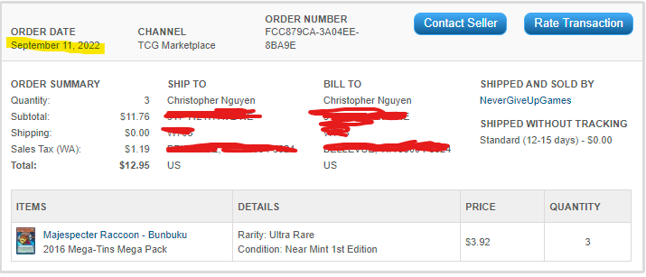
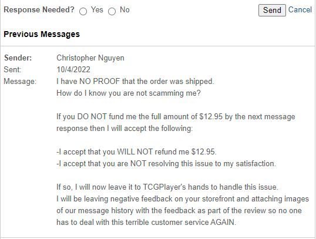
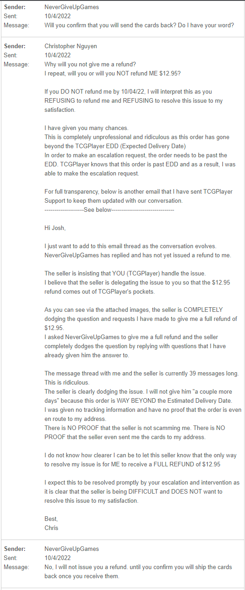
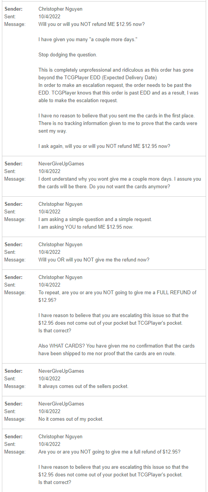
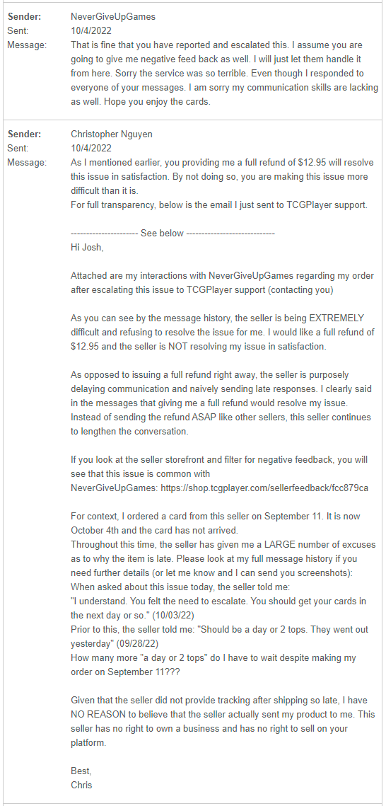
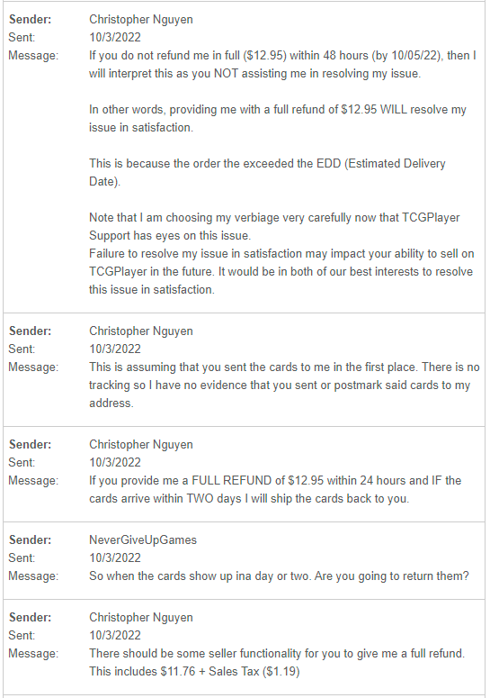
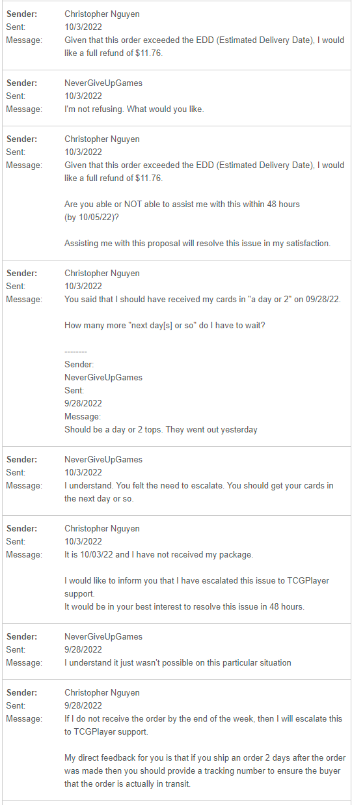
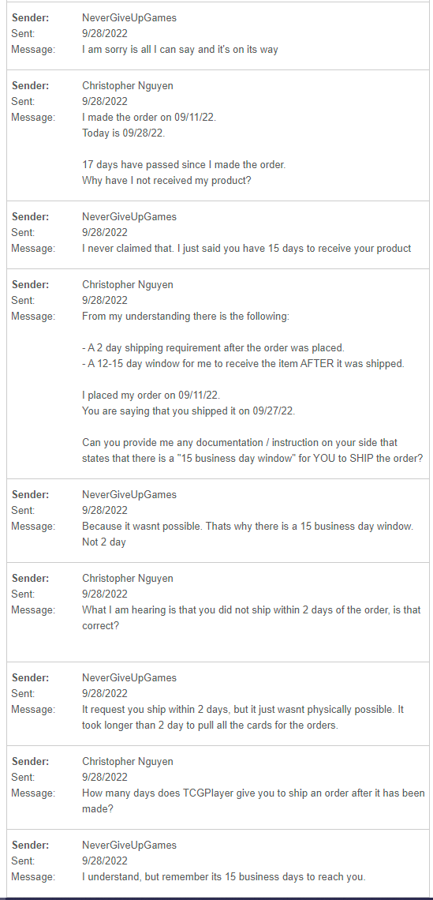
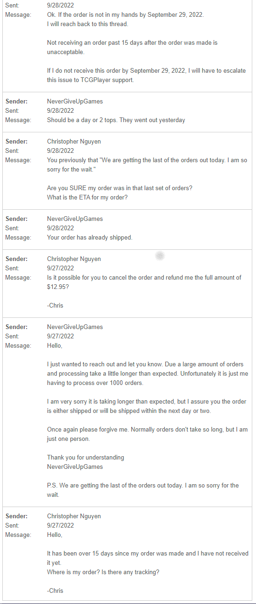

# NeverGiveUpGames

## Below highlights my interactions with NeverGiveUpGames.  
I ordered from NeverGiveUpGames on September 11, 2022.  
As of October 03, 2022, the order has not arrived.  

 
I contacted NeverGiveUpGames regarding this order going beyond the EDD (Estimated Delivery Date).  
From the conversation, I have concluded the following:  
- The seller REFUSES to refund me any amount.  
- The seller says the cards are on the way but has NO PROOF OR TRACKING INFORMATION to confirm that the cards are enroute.  
- The seller DODGES every request or opportunity to refund me when asked.  
 

Below is my full message history with the seller.  
This should be read bottom-up as the latest messages are on top.  

One noteworthy thing to mention is that the seller asked if he has MY WORD that I'll return the cards if I receive them.  
In this interaction, why should any party trust the other party's words when the seller has repeatedly told me that "the cards show up ina day or two" despite them not showing up.  
How many more "day or two" do I have to wait till HIS WORDS are valid?  

### End of Message: DO NOT READ FROM THE TOP-DOWN, READ STARTING FROM THE BOTTOM-UP ###

### Beginning of Message: READ STARTING FROM HERE, READ STARTING FROM HERE TO THE TOP ###
